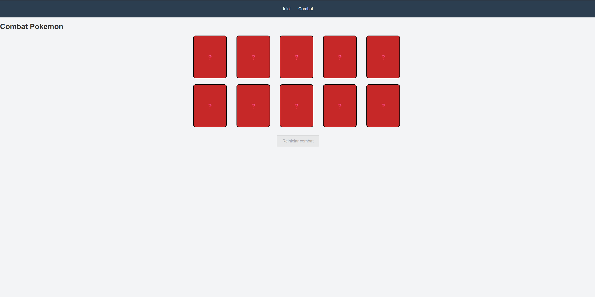
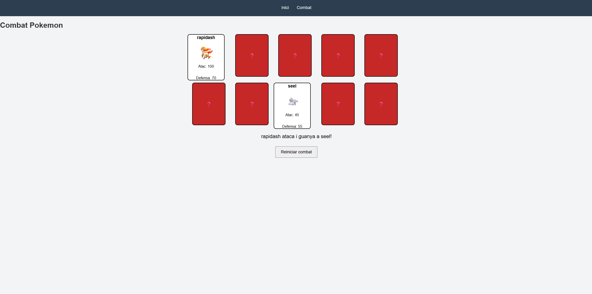

# 📌 Pokémon Web App (Vue.js)

This is a web application developed using **Vue.js**, HTML5, and CSS3.  
It is a framework-based version of the Pokémon Web App, built to demonstrate component-based architecture, reactivity, and state management using Vue.

> ⚠️ **Note:** All content is written in Catalan.

## 🚀 Screenshots

## 🧩 Features

### 🏠 Home Page
- ✅ Generates 10 random Pokémon cards using the Pokémon API
- ✅ Each card displays:
  - Pokémon name
  - Image
  - Attack
  - Defense
  - Types (with corresponding colors)
- ✅ Button to generate 10 new random Pokémon
- ✅ Search bar to filter Pokémon by name (only among generated Pokémon)
- ✅ Component-based card system

### ⚔️ Combat Page
- ✅ Generates 10 random Pokémon cards face down
- ✅ Player selects two Pokémon to battle
- ✅ Simple combat system:
  - If Pokémon A’s **attack** is higher than Pokémon B’s **defense**, Pokémon A wins
  - Otherwise, Pokémon B wins
- ✅ Button to restart and regenerate the cards
- ✅ State handled reactively with Vue

## 🛠️ Technologies

- Vue.js
- HTML5
- CSS3
- JavaScript (ES6)
- Pokémon API

## 🌐 API Used

- [PokéAPI](https://pokeapi.co/)

## 📄 Notes

- This project is a Vue.js adaptation of a vanilla JavaScript version of the same application.
- The goal is to compare framework-based development with plain JavaScript in terms of structure, scalability, and maintainability.
